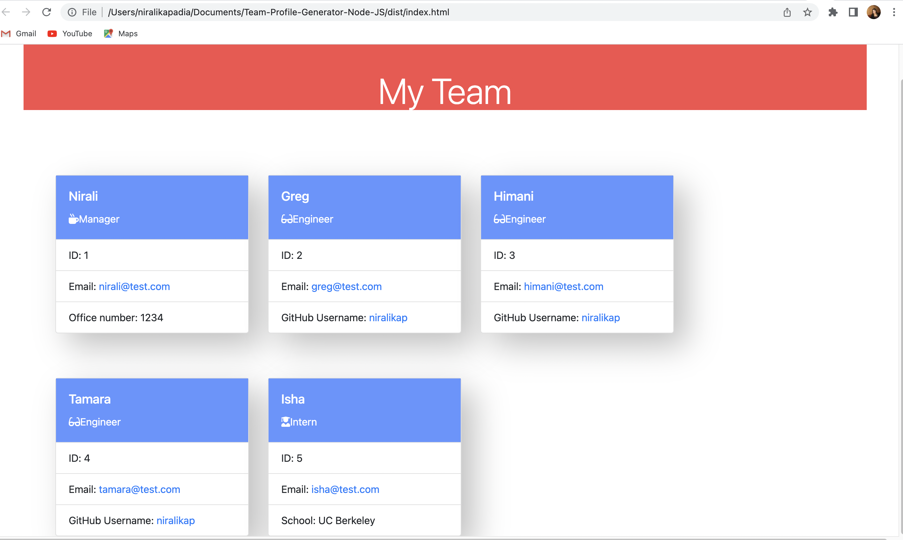
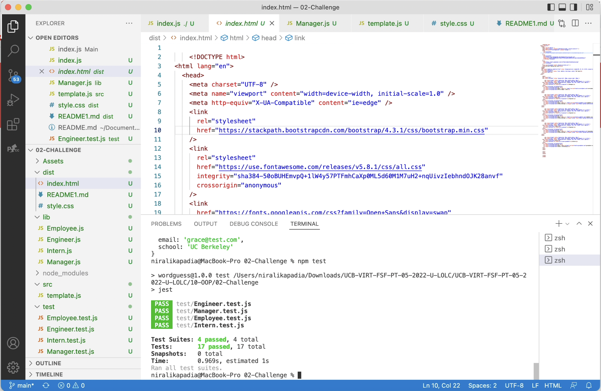
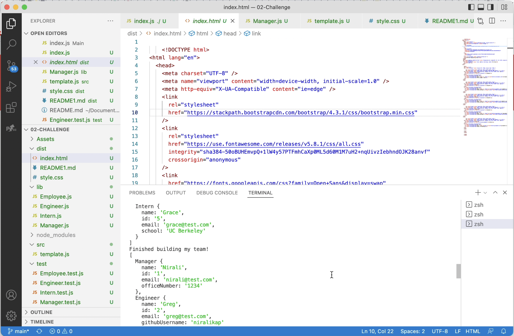

# Team-Profile-Generator-Node-JS

# 10 Object-Oriented Programming: Team Profile Generator

## User Story

AS A manager
I WANT to generate a webpage that displays my team's basic info
SO THAT I have quick access to their emails and GitHub profiles

## Description

In this assignment, I have used 'Node JS' to build a command line application that accepts the user input of the various team members in the organization and generates a Team Profile Generator.

The application should use 'Jest' for running the unit tests and the 'Inquirer' package for collecting input from the user. The application will be invoked by using the following command:

bash
node index.js

The application does the following:

- It is a command-line application that accepts user input.

- When I am prompted for my team members and their information, then an HTML file is generated that displays a nicely formatted team roster based on user input.

- When I click on an email address in the HTML, then my default email program opens and populates the TO field of the email with the address.

- When I click on the GitHub username, then that GitHub profile opens in a new tab.

- When I start the application, then I am prompted to enter the team manager’s name, employee ID, email address, and office number.

- When I enter the team manager’s name, employee ID, email address, and office number, then I am presented with a menu with the option to add an engineer or an intern or to finish building my team.

- When I select the engineer option, then I am prompted to enter the engineer’s name, ID, email, and GitHub username, and I am taken back to the menu.

- When I select the intern option, then I am prompted to enter the intern’s name, ID, email, and school, and I am taken back to the menu.

- When I decide to finish building my team, then I exit the application, and the HTML is generated.

